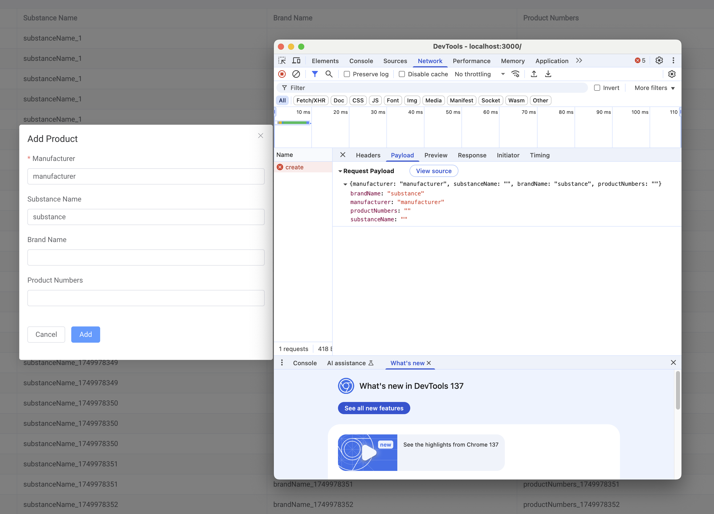
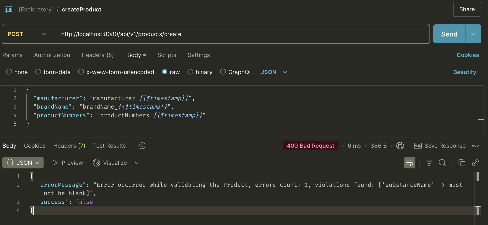
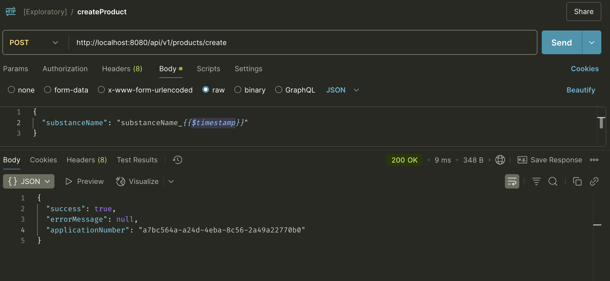
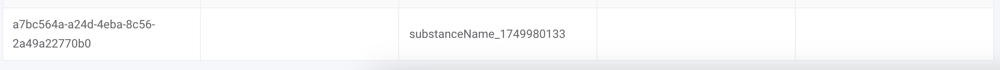

# Test Strategy

## Introduction
The application under test consists of both a backend layer and a frontend layer; as such, we will need to test both of these layers independently and in combination.\
The purpose of this document is to identify the scope that our testing will have, as well as the different test plans and test cases that we should carry out.

The API testing framework is located in [ha-products-be-tests](https://github.com/edugarver/home-assignment/tree/master/ha-products-be-tests)
The UI testing framework is located in [ha-products-ui-tests](https://github.com/edugarver/home-assignment/tree/master/ha-products-ui-tests)

## Initial considerations
- We will assume that the acceptance criteria given in the home assignment document is valid for both the frontend and backend parts
- It is also assumed that both parts of the application are running, and that the UI is running on the backend project. If the UI is running on the provided mocked backend, the behavior differs in some points; for example, products are not immediately available after creation or there are differences in required fields.
- We will have two test projects, one for UI and one for API, and they will live separately from the application under test. This is done for clarity reasons.
- Some of the automated test cases will fail. The test cases have been written and automated according to the provided description.\
However, the given application does not fulfill this description; for example:
  - the acceptance criteria for "Add Products" mentions that "Manufacturer name" and "Substance name" are required,
  - the UI only marks "Manufacturer" as required
  - in the UI, the field marked as "Substance name" is sent to the API as the "Brand name" (see below screenshot)
  
  - and when it comes to the API, the swagger documentation doesn't specify which property is required, but by exploratory testing it looks like only substance name is actually required (see below screenshots)
  
  
  

## Testing scope
For the purpose of the exercise, we are going to focus on executing API tests for the backend part, and functional tests for the frontend part.\
Other types of testing such as unit testing, performance testing, security testing and so on are out of scope.

## Test plans
We will have the following test plans in each of the testing frameworks:
 - Smoke tests: basic set of tests for each functionality and endpoint. The main goal is to prove that the basic functionality is working
 - Regression tests: these tests should cover as many testing categories as possible: basic positive tests (including the smoke ones), negative tests...
 - E2E tests: the tests will be a chain of endpoints or actions that are used in the most important user flows.
 
 Each test case will be marked with the test plan it belongs too in the test case description.

## Test cases
The test cases will be separated in both API and UI sections.\
Since the acceptance criteria was given in BDD format, the test cases will also be written in BDD for consistency. I will use the following format:
```gherkin
@planTag @testIdTag
Scenario: <scenarioTitle>
Given <step>
When <step>
Then <step>
```
Unless specified otherwise, the tests will assume that the database is populated with correct data. This means that I won't include 

### API tests
```gherkin
@tc1 @smoke @regression
Scenario: List all products
Given path <baseUrl>/api/v1/products/list
When I make a GET request
Then status code is 200
And response body is an array of objects
And each object looks like the following 
{ 
  "applicationNumber": "string", 
  "manufacturer": "string", 
  "substanceName": "string",
  "brandName": "string",
  "productNumbers": "string"
}

@tc2 @smoke @regression 
Scenario: Create a product
Given path <baseUrl>/api/v1/products/create
And request body is
{
  "manufacturer": <manufacturer>, 
  "substanceName": <substanceName>,
  "brandName": <brandName>,
  "productNumbers": <productNumbers>
}
When I make a POST request
Then status code is 200
And response body is
{
  "success": true,
  "errorMessage": "string",
  "applicationNumber": "string"
}

@tc3 @smoke @regression 
Scenario: Search for a product
Given product with manufacturer <manufacturer> and brandName <brandName> exists
And path <baseUrl>/api/v1/products/search
And request body is 
{
  "manufacturer": <manufacturer>,
  "brandName": <brandName>
}
When I make a POST request
Then status code is 200
And response body is an array of objects
And each object looks like the following
{ 
  "applicationNumber": "string", 
  "manufacturer": <manufacturer>,
  "substanceName": "string",
  "brandName": <brandName>
  "productNumbers": "string"
}

@tc4 @regression 
Scenario: Create a product with only the required properties
Given path <baseUrl>/api/v1/products/create
And request body is
{
  "manufacturer": <manufacturer>,
  "substanceName": <substanceName>
}
When I make a POST request
Then status code is 200
And response body is as expected

@tc5 @regression @bug
Scenario: It is not possible to create a product with an empty manufacturer
Given path <baseUrl>/api/v1/products/create
And request body is
{
  "manufacturer": "",
  "substanceName": <substanceName>,
  "brandName": <brandName>,
  "productNumbers": <productNumbers>
}
When I make a POST request
Then status code is 400
And error message is "Error occurred while validating the Product, errors count: 1, violations found: ['manufacturer' -> must not be blank]"

@tc6 @regression 
Scenario: It is not possible to create a product with an empty substance name
Given path <baseUrl>/api/v1/products/create
And request body is
{
  "manufacturer": <manufacturer>,
  "substanceName": "",
  "brandName": <brandName>,
  "productNumbers": <productNumbers>
}
When I make a POST request
Then status code is 400
And error message is "Error occurred while validating the Product, errors count: 1, violations found: ['substanceName' -> must not be blank]"

@tc7 @regression @bug
Scenario: Request body properties cannot be of type other than String on creation
Given path <baseUrl>/api/v1/products/create
And request body is
{
  "manufacturer": <randomValue>,
  "substanceName": <randomValue>,
  "brandName": <randomValue>,
  "productNumbers": <randomValue>
}
When I make a POST request
Then status code is 400

@tc8 @regression @bug
Scenario: It is not possible to create a product with a manufacturer longer than 50 characters
Given path <baseUrl>/api/v1/products/create
And we set manufacturer in request body to a string longer than 50 characters
When I make a POST request
Then status code is 400

@tc9 @regression @bug
Scenario: It is not possible to create a product with a substance name longer than 50 characters
Given path <baseUrl>/api/v1/products/create
And we set substance name in request body to a string longer than 50 characters
When I make a POST request
Then status code is 400

@tc10 @regression @bug
Scenario: It is not possible to create a product with a brand name longer than 50 characters
Given path <baseUrl>/api/v1/products/create
And we set brand name in request to a string longer than 50 characters
When I make a POST request
Then status code is 400

@tc11 @regression @bug
Scenario: It is not possible to create a product with a product number longer than 1000 characters
Given path <baseUrl>/api/v1/products/create
And we set product number in request body to a string longer than 1000 characters
When I make a POST request
Then status code is 400

@tc12 @regression
Scenario: Search for a product with empty body
Given path <baseUrl>/api/v1/products/search
And request body is {}
When I make a POST request
Then status code is 200
And all products are returned in response

@tc13 @regression
Scenario: Search for a product with only manufacturer
Given path <baseUrl>/api/v1/products/search
And request body is
{
  "manufacturer": <manufacturer>
}
When I make a POST request
Then status code is 200
And all products with the given manufacturer are returned in response

@tc14 @regression
Scenario: Search for a product with only brand name
Given path <baseUrl>/api/v1/products/search
And request body is
{
  "brandName": <brandName>
}
When I make a POST request
Then status code is 200
And all products with the given brand name are returned in response

@tc15 @regression
Scenario: Search for a product with non-existing manufacturer
Given path <baseUrl>/api/v1/products/search
And request body is
{
  "manufacturer": <nonExistingManufacturer>
}
When I make a POST request
Then status code is 200
And response body is an empty array

@tc16 @regression
Scenario: Search for a product with non-existing brand name
Given path <baseUrl>/api/v1/products/search
And request body is
{
  "brandName": <nonExistingBrandName>
}
When I make a POST request
Then status code is 200
And response body is an empty array

@tc17 @regression
Scenario: Request body properties cannot be of type other than String on search
Given path <baseUrl>/api/v1/products/search
And request body is
{
  "manufacturer": <notAString>,
  "brandName": <notAString>
}
When I make a POST request
Then status code is 400

@tc18 @e2e
Scenario: Create a product and search for it
Given path <baseUrl>/api/v1/products/create
And request body is
{
  "manufacturer": <manufacturer>,
  "substanceName": <substanceName>,
  "brandName": <brandName>,
  "productNumbers": <productNumbers>
}
When I make a POST request
Then status code is 200
And response body is
{
  "success": true,
  "errorMessage": "string",
  "applicationNumber": "string"
}
Given path <baseUrl>/api/v1/products/list
When I make a GET request
Then status code is 200
And created product is present in the response body
Given path <baseUrl>/api/v1/products/search
And request body is 
{
  "manufacturer": <manufacturer>,
  "brandName": <brandName>
}
When I make a POST request
Then status code is 200
And response body is an array of objects
And each object looks like the following
{ 
  "applicationNumber": "string", 
  "manufacturer": <manufacturer>,
  "substanceName": "string",
  "brandName": <brandName>
  "productNumbers": "string"
}
```
### UI tests
```gherkin
@tc1 @smoke @regression
Scenario: Products List page is displayed
Given application is running on <baseUrl>
When I navigate to <baseUrl>
Then "Products List" page is displayed
And the page has a title "Products List"
And "Search by manufacturer" input is present
And "Search by brand name" input is present
And "Search" button is present
And "Add Product" button is present
And a table with products is present
And the table has the following columns: "Application Number", "Manufacturer", "Substance Name", "Brand Name", "Product Numbers"

@tc2 @smoke @regression
Scenario: Create a product
Given I am on "Products List" page
And I click on "Add Product" button
Then "Add Product" form is displayed
And the form has a title "Add Product"
And the form has the following fields: "Manufacturer", "Substance Name", "Brand Name", "Product Numbers"
And the fields "Manufacturer" and "Substance Name" are required
And the form has "Cancel" and "Add" buttons
And "Add" button is disabled
When I fill in "Manufacturer" with <manufacturer>
And I fill in "Substance Name" with <substanceName>
And I fill in "Brand Name" with <brandName>
And I fill in "Product Numbers" with <productNumbers>
Then "Add" button is enabled
When I click on "Add" button
Then "Products List" page is displayed
And the product with "Manufacturer" <manufacturer>, "Substance Name" <substanceName>, "Brand Name" <brandName> and "Product Numbers" <productNumbers> is present in the table

@tc3 @smoke @regression
Scenario: Search for a product
Given I am on "Products List" page
And I fill in "Search by manufacturer" with <manufacturer>
And I fill in "Search by brand name" with <brandName>
When I click on "Search" button
Then products with "Manufacturer" <manufacturer> and "Brand Name" <brandName> are displayed in the table

@tc4 @regression
Scenario: "Add" button is disabled when required fields are empty
Given I am on "Products List" page
When I click on "Add Product" button
Then "Add Product" form is displayed
And "Add" button is disabled
When I fill in "Product Numbers" with <productNumbers>
And I fill in "Brand Name" with <brandName>
Then "Add" button is still disabled
When I fill in "Manufacturer" with <manufacturer>
And I fill in "Substance Name" with <substanceName>
Then "Add" button is enabled

@tc5 @regression
Scenario: "Cancel" button closes the form
Given I am on "Products List" page
When I click on "Add Product" button
Then "Add Product" form is displayed
When I click on "Cancel" button
Then "Products List" page is displayed

@tc6 @regression
Scenario: Search with empty inputs returns all products
Given I am on "Products List" page
When I click on "Search" button without filling in any inputs
Then all products are displayed in the table

@tc7 @regression
Scenario: Search with only manufacturer input
Given I am on "Products List" page
When I fill in "Search by manufacturer" with <manufacturer>
And I click on "Search" button
Then products with "Manufacturer" <manufacturer> are displayed in the table

@tc8 @regression
Scenario: Search with only brand name input
Given I am on "Products List" page
When I fill in "Search by brand name" with <brandName>
And I click on "Search" button
Then products with "Brand Name" <brandName> are displayed in the table

@tc9 @regression
Scenario: Search with non-existing manufacturer
Given I am on "Products List" page
When I fill in "Search by manufacturer" with <nonExistingManufacturer>
And I click on "Search" button
Then no products are displayed in the table

@tc10 @regression
Scenario: Search with non-existing brand name
Given I am on "Products List" page
When I fill in "Search by brand name" with <nonExistingBrandName>
And I click on "Search" button
Then no products are displayed in the table

@tc11 @e2e
Scenario: Create a product and search for it
Given application is running on <baseUrl>
When I navigate to <baseUrl>
Then "Products List" page is displayed
When I click on "Add Product" button
Then "Add Product" form is displayed
And I fill in "Manufacturer" with <manufacturer>
And I fill in "Substance Name" with <substanceName>
And I fill in "Brand Name" with <brandName>
And I fill in "Product Numbers" with <productNumbers>
When I click on "Add" button
Then "Products List" page is displayed
And the product with "Manufacturer" <manufacturer>, "Substance Name" <substanceName>, "Brand Name" <brandName> and "Product Numbers" <productNumbers> is present in the table
When I fill in "Search by manufacturer" with <manufacturer>
And I fill in "Search by brand name" with <brandName>
When I click on "Search" button
Then products with "Manufacturer" <manufacturer> and "Brand Name" <brandName> are displayed in the table

@tc12 @regression
Scenario: Max length for input fields
Given I am on "Products List" page
When I click on "Add Product" button
Then "Add Product" form is displayed
And I fill in "Manufacturer" with a string longer than 50 characters
Then an error message is displayed saying "Max 50 characters"
And "Add" button is disabled
When I fill in "Substance Name" with a string longer than 50 characters
Then an error message is displayed saying "Max 50 characters"
And "Add" button is disabled
When I fill in "Brand Name" with a string longer than 50 characters
Then an error message is displayed saying "Max 50 characters"
And "Add" button is disabled
When I fill in "Product Numbers" with a string longer than 1000 characters
Then an error message is displayed saying "Max 999 characters"
